# HONDI — 제주 혼행 커뮤니티 플랫폼

> **"혼자서도 즐거운 제주 여행"**
> 서비스 URL: https://hondi.site

---

## 프로젝트 개요

### 1. 기획의도

- 혼자 여행하는 인구는 매년 증가하고 있으나, 대부분의 여행 플랫폼은 2인 이상 패키지 상품 위주로 구성되어 있음
- 혼자 여행 중 동행을 구하고 싶어도 신뢰할 수 있는 인적 정보가 없어 안전에 대한 우려가 있음
- 실제 여행 후기나 혼행 관련 정보를 한 곳에서 얻기 어려움
- **제주도**라는 국내 대표 혼행 여행지에 특화된 커뮤니티 플랫폼의 필요성에서 출발

---

## 프로젝트의 목적

> "혼자 제주를 여행하는 이들을 위해 동행 매칭, 숙소 정보, 여행 후기를 한곳에서 제공하는
> 제주 특화 혼행 커뮤니티 플랫폼 구축"

### 제공하는 기능

- **동행 구하기 게시판** : 여행 일정·지역·나이대를 공개하고 동행을 모집할 수 있는 게시판
- **숙소 정보 & 리뷰** : 제주 숙소를 검색하고 실제 투숙 후기와 평점을 확인
- **여행 후기 게시판** : 혼행 경험을 공유하고 다른 여행자들과 소통하는 게시판
- **자유 게시판** : 제주 여행 관련 자유로운 정보 공유 공간
- **실시간 1:1 채팅** : 동행 신청 후 WebSocket 기반 채팅으로 직접 소통
- **실시간 알림** : 동행 신청·댓글·채팅 등 주요 활동 SSE 알림
- **카카오 지도 & 장소 검색** : 제주 명소·맛집·카페를 지도에서 탐색
- **즐겨찾기** : 숙소·동행글·후기를 저장하여 마이페이지에서 모아보기
- **SNS 공유** : 카카오톡 공유 및 URL 복사
- **관리자 페이지** : 회원·게시글·신고·문의·공지 통합 관리

---

## 프로젝트 소개

### 1. 개발자 소개

| 이름 | 역할 |
|------|------|
| 창식 | 풀스택 1인 개발 (기획 · 설계 · 프론트엔드 · 백엔드 · 배포) |

### 2. 개발 기간

- 2026.01.29 ~ 2026.02.27 (약 4주)

---

## 기술 스택

### Frontend

| 분류 | 기술 |
|------|------|
| 프레임워크 | React 18, Vite |
| 언어 | TypeScript / JavaScript |
| 스타일 | Tailwind CSS |
| 애니메이션 | Framer Motion |
| 상태·서버 상태 관리 | React Query (TanStack Query) |
| 라우팅 | React Router v6 |
| HTTP | Axios |
| 아이콘 | Lucide React |

### Backend

| 분류 | 기술 |
|------|------|
| 프레임워크 | Spring Boot 3 |
| ORM | MyBatis |
| 데이터베이스 | Oracle DB |
| 보안 | Spring Security, JWT (jjwt) |
| 실시간 통신 | WebSocket (SockJS / STOMP) |
| 알림 | SSE (Server-Sent Events) |

### Infrastructure & External API

| 분류 | 기술 |
|------|------|
| 클라우드 | AWS EC2 |
| 웹서버 | Nginx (Reverse Proxy) |
| 지도 | Kakao Maps SDK, Kakao Places API |
| 로그인 | Kakao OAuth 2.0 |
| 공유 | Kakao Share SDK |
| 이미지 압축 | Canvas API (WebP 변환) |

---

## ERD

```mermaid
erDiagram
    MEMBER {
        NUMBER MEMBER_NO PK
        VARCHAR2 EMAIL
        VARCHAR2 PASSWORD
        VARCHAR2 NICKNAME
        VARCHAR2 NAME
        VARCHAR2 PHONE
        VARCHAR2 GENDER
        VARCHAR2 AGE_RANGE
        VARCHAR2 PROFILE_IMAGE
        VARCHAR2 INTRO
        VARCHAR2 MEMBER_TYPE
        VARCHAR2 STATUS
        VARCHAR2 LOGIN_TYPE
        DATE CREATED_AT
    }

    ACCOMMODATION {
        NUMBER ACCOMMODATION_NO PK
        VARCHAR2 NAME
        VARCHAR2 ADDRESS
        VARCHAR2 PHONE
        NUMBER PRICE_MIN
        NUMBER PRICE_MAX
        VARCHAR2 REGION
        NUMBER LATITUDE
        NUMBER LONGITUDE
        VARCHAR2 THUMBNAIL_URL
        NUMBER VIEW_COUNT
        VARCHAR2 STATUS
    }

    ACCOMMODATION_REVIEW {
        NUMBER REVIEW_NO PK
        NUMBER ACCOMMODATION_NO FK
        NUMBER MEMBER_NO FK
        NUMBER RATING
        CLOB CONTENT
        DATE CHECK_IN_DATE
        DATE CHECK_OUT_DATE
        DATE CREATED_AT
    }

    ACCOM_WISHLIST {
        NUMBER WISHLIST_NO PK
        NUMBER ACCOMMODATION_NO FK
        NUMBER MEMBER_NO FK
        DATE CREATED_AT
    }

    COMPANION_BOARD {
        NUMBER COMPANION_NO PK
        NUMBER MEMBER_NO FK
        VARCHAR2 TITLE
        CLOB CONTENT
        DATE TRAVEL_DATE
        NUMBER MAX_MEMBERS
        VARCHAR2 TAGS
        VARCHAR2 STATUS
        DATE CREATED_AT
    }

    COMPANION_JOIN {
        NUMBER JOIN_NO PK
        NUMBER COMPANION_NO FK
        NUMBER MEMBER_NO FK
        VARCHAR2 STATUS
        DATE CREATED_AT
    }

    COMPANION_WISHLIST {
        NUMBER WISHLIST_NO PK
        NUMBER COMPANION_NO FK
        NUMBER MEMBER_NO FK
        DATE CREATED_AT
    }

    COMPANION_REVIEW {
        NUMBER REVIEW_NO PK
        NUMBER COMPANION_NO FK
        NUMBER MEMBER_NO FK
        VARCHAR2 TITLE
        CLOB CONTENT
        NUMBER RATING
        VARCHAR2 STATUS
        DATE CREATED_AT
    }

    REVIEW_WISHLIST {
        NUMBER WISHLIST_NO PK
        NUMBER REVIEW_NO FK
        NUMBER MEMBER_NO FK
        DATE CREATED_AT
    }

    BOARD {
        NUMBER BOARD_NO PK
        NUMBER MEMBER_NO FK
        VARCHAR2 BOARD_CODE
        VARCHAR2 TITLE
        CLOB CONTENT
        NUMBER VIEW_COUNT
        VARCHAR2 STATUS
        DATE CREATED_AT
    }

    BOARD_LIKE {
        NUMBER LIKE_NO PK
        NUMBER BOARD_NO FK
        NUMBER MEMBER_NO FK
        DATE CREATED_AT
    }

    COMMENT_TBL {
        NUMBER COMMENT_NO PK
        NUMBER BOARD_NO FK
        NUMBER MEMBER_NO FK
        NUMBER PARENT_COMMENT_NO FK
        CLOB CONTENT
        VARCHAR2 STATUS
        DATE CREATED_AT
    }

    CHATTING_ROOM {
        NUMBER CHATTING_ROOM_NO PK
        NUMBER OPEN_MEMBER FK
        NUMBER PARTICIPANT FK
        DATE CREATED_AT
    }

    MESSAGE {
        NUMBER MESSAGE_NO PK
        NUMBER CHATTING_ROOM_NO FK
        NUMBER SENDER_NO FK
        CLOB MESSAGE_CONTENT
        VARCHAR2 READ_FL
        DATE SEND_TIME
    }

    NOTIFICATION {
        NUMBER NOTIFICATION_NO PK
        NUMBER RECIPIENT_NO FK
        NUMBER SENDER_NO FK
        VARCHAR2 NOTIFICATION_TYPE
        VARCHAR2 TARGET_TYPE
        NUMBER TARGET_NO
        VARCHAR2 READ_FL
        DATE CREATED_AT
    }

    INQUIRY {
        NUMBER INQUIRY_NO PK
        NUMBER MEMBER_NO FK
        VARCHAR2 CATEGORY
        VARCHAR2 TITLE
        CLOB CONTENT
        CLOB ANSWER
        VARCHAR2 STATUS
        DATE CREATED_AT
    }

    CONTENT_REPORT {
        NUMBER REPORT_NO PK
        NUMBER MEMBER_NO FK
        VARCHAR2 TARGET_TYPE
        NUMBER TARGET_NO
        VARCHAR2 REPORT_TYPE
        VARCHAR2 STATUS
        DATE CREATED_AT
    }

    SPOT {
        NUMBER SPOT_NO PK
        VARCHAR2 SPOT_TITLE
        VARCHAR2 SPOT_DESC
        VARCHAR2 SPOT_LOCATION
        VARCHAR2 SPOT_IMAGE
        VARCHAR2 SPOT_TAG
        VARCHAR2 SPOT_STATUS
        DATE CREATED_AT
    }

    MEMBER ||--o{ ACCOMMODATION_REVIEW : "작성"
    MEMBER ||--o{ ACCOM_WISHLIST : "저장"
    MEMBER ||--o{ COMPANION_BOARD : "작성"
    MEMBER ||--o{ COMPANION_JOIN : "신청"
    MEMBER ||--o{ COMPANION_WISHLIST : "저장"
    MEMBER ||--o{ COMPANION_REVIEW : "작성"
    MEMBER ||--o{ REVIEW_WISHLIST : "저장"
    MEMBER ||--o{ BOARD : "작성"
    MEMBER ||--o{ BOARD_LIKE : "좋아요"
    MEMBER ||--o{ COMMENT_TBL : "댓글"
    MEMBER ||--o{ NOTIFICATION : "수신"
    MEMBER ||--o{ INQUIRY : "문의"
    MEMBER ||--o{ CONTENT_REPORT : "신고"
    ACCOMMODATION ||--o{ ACCOMMODATION_REVIEW : "리뷰"
    ACCOMMODATION ||--o{ ACCOM_WISHLIST : "찜"
    COMPANION_BOARD ||--o{ COMPANION_JOIN : "신청"
    COMPANION_BOARD ||--o{ COMPANION_WISHLIST : "찜"
    COMPANION_BOARD ||--o{ COMPANION_REVIEW : "후기"
    COMPANION_REVIEW ||--o{ REVIEW_WISHLIST : "찜"
    BOARD ||--o{ BOARD_LIKE : "좋아요"
    BOARD ||--o{ COMMENT_TBL : "댓글"
    CHATTING_ROOM ||--o{ MESSAGE : "메시지"
```



---

## 프로젝트 구조

```
finalProject/
├── fronted/                  # React + Vite 프론트엔드
│   └── src/
│       ├── api/              # API 모듈 & React Query 훅
│       ├── components/       # 공통·페이지별 컴포넌트
│       │   ├── common/       # 공통 컴포넌트 (KakaoMap, Header, Footer ...)
│       │   ├── main/         # 메인 페이지 섹션 컴포넌트
│       │   └── mypage/       # 마이페이지 컴포넌트
│       ├── pages/            # 페이지 컴포넌트
│       │   ├── accommodation/
│       │   ├── companion/
│       │   ├── review/
│       │   ├── freeboard/
│       │   └── mypage/
│       └── lib/              # 유틸리티 (이미지 압축, 날짜 포맷 등)
│
└── backend/                  # Spring Boot 백엔드
    └── src/main/java/edu/kh/project/
        ├── accommodation/    # 숙소
        ├── companion/        # 동행 게시판
        ├── freeboard/        # 자유 게시판
        ├── member/           # 회원
        ├── chatting/         # 채팅
        ├── notification/     # 알림
        ├── spot/             # 명소
        ├── admin/            # 관리자
        └── common/           # 공통 (JWT, Security, CORS 설정)
```

---

## 주요 화면

### 메인 페이지
> Framer Motion 애니메이션 · 숙소/동행/후기 하이라이트 · 반응형 레이아웃

<div align="center">
  <video src="https://github.com/user-attachments/assets/8893a548-7f66-46f9-b4c8-18a82070cac7" width="800" autoplay loop muted playsinline />
</div>

<br />

### 실시간 1:1 채팅
> WebSocket (STOMP / SockJS) 기반 실시간 채팅 · 메시지 읽음 처리

<div align="center">
  <video src="https://github.com/user-attachments/assets/9c580144-0558-4f4a-b3c3-140ba03d60c4" width="800" autoplay loop muted playsinline />
</div>

<br />

### 동행 구하기
> 일정·지역·태그 기반 동행 모집 · 신청 및 수락/거절 플로우

<div align="center">
  <video src="https://github.com/user-attachments/assets/f5278b0b-c4f5-4da5-8fbc-79dd4731ecda" width="800" autoplay loop muted playsinline />
</div>

<br />

### 제주 명소 지도
> Kakao Maps SDK · Places API 카테고리 검색 (맛집·카페·관광지)

<div align="center">
  <video src="https://github.com/user-attachments/assets/bbd5fd3d-54e3-4612-afbd-d63477fbbf21" width="800" autoplay loop muted playsinline />
</div>

<br />

### 실시간 알림
> SSE(Server-Sent Events) 기반 알림 · 동행 신청·댓글·채팅 알림 배지

<div align="center">
  <video src="https://github.com/user-attachments/assets/75cf7dc0-97ab-4a4b-bc90-cc99d15ac22d" width="800" autoplay loop muted playsinline />
</div>

<br />

### 카카오 소셜 로그인
> Kakao OAuth 2.0 인증 · JWT 토큰 발급

<div align="center">
  <video src="https://github.com/user-attachments/assets/8f3a24aa-c363-4f35-8d61-0d6be69ea18c" width="800" autoplay loop muted playsinline />
</div>

<br />

### 관리자 페이지
> 회원·게시글·신고·문의·공지 통합 관리 · 권한(ROLE) 기반 접근 제어

<div align="center">
  <video src="https://github.com/user-attachments/assets/a3cad3cc-d734-4cb1-bafe-bdf39f309b89" width="800" autoplay loop muted playsinline />
</div>

---

## 로컬 실행 방법

### Frontend
```bash
cd fronted
npm install
npm run dev       # http://localhost:5173
```

### Backend
```bash
cd backend
./gradlew bootRun # http://localhost:8080
```

> ⚠️ `application.properties`에 Oracle DB 접속 정보 및 API 키 설정 필요

---

## 주요 구현 포인트

- **JWT 인증** : Access Token 기반 무상태 인증, 컨트롤러 레벨 검증
- **이미지 최적화** : Canvas API로 업로드 전 WebP 변환 및 압축 (최대 1024px, 0.72 품질)
- **실시간 채팅** : STOMP over SockJS 웹소켓
- **실시간 알림** : SSE(Server-Sent Events)로 읽지 않은 알림 배지 표시
- **카카오맵 통합** : 명소 지도 + 장소 검색(Places API) 통합 섹션
- **소셜 로그인** : Kakao OAuth 2.0
